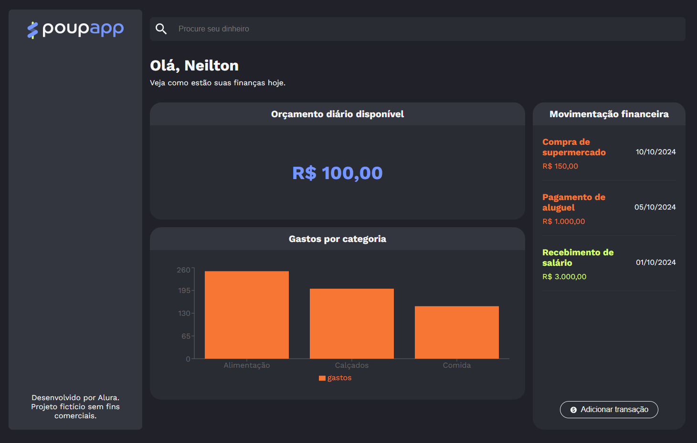

# 💰 PoupApp

O PoupApp é uma plataforma de gerenciamento financeiro voltada para ajudar usuários a organizar suas finanças. Focado na simplicidade, o PoupApp permite que os usuários acompanhem seus gastos, definam metas financeiras e visualizem seu progresso através de gráficos dinâmicos. 

Com funcionalidades que incentivam o controle de despesas e a organização do orçamento diário, o PoupApp se torna o parceiro ideal para quem busca saúde financeira e realização de objetivos pessoais.

<p align="center">
  
</p>

## 📝 Sobre o Projeto

O PoupApp oferece as seguintes funcionalidades:

- Acompanhar o orçamento diário e manter o controle das suas despesas.
- Realizar transações de maneira prática, adicionando despesas e receitas.
- Analisar seus gastos por meio de gráficos dinâmicos, categorizando as despesas para melhor entendimento.

## 🛠️ Técnicas e tecnologias utilizadas

O projeto foi desenvolvido utilizando as seguintes tecnologias:

- `Typescript` - Linguagem que adiciona tipagem estática ao JavaScript.
- `React.js` - Biblioteca para construção de interfaces dinâmicas.
- `Vite` - Ferramenta de construção rápida para desenvolvimento com JavaScript moderno.
- `Styled-components` - Para estilização de componentes com CSS-in-JS.
- `Context API` - Gerenciamento de estado de forma reativa.
- `React Router` - Para navegação entre páginas da aplicação.
- `Recharts` - Para criação e visualização de gráficos.
- `Figma` - Para prototipagem e design visual do projeto.

E outras dependências e ferramentas auxiliares.

## 💻 Como usar
### ☁️Clonar o repositório:
1. Para usar a aplicação, clone o repositório em seu ambiente local, você pode fazer isso executando o seguinte comando no terminal: git clone https://github.com/GGasparotto-code/PoupApp.git;

### ⬇️Fazendo o download do repositório:
1. Clique no botão "Code" neste repositório e faça o download;
2. Salve o arquivo ZIP em seu computador e descompacte-o;
3. Abra a pasta descompactada no VS Code. Para isso, siga os passos abaixo:

> - **File > Open Folder** (ou uma opção similar).
> - Procure o local onde o projeto foi salvo e selecione a pasta (se o projeto foi baixado como um arquivo ZIP, será necessário extraí-lo antes).
> - Clique em **OK**.

## ▶️ Executar o projeto
Para rodar o projeto, será necessário executar os seguintes comandos:

1. Instalação das Dependências:
Primeiro, você precisa instalar todas as dependências do projeto. Abra o terminal na pasta raiz do projeto e execute:
> ```npm install```

2. Executar o Backend (JSON Server):
O projeto utiliza o json-server para simular uma API REST. Se você ainda não o tem instalado, execute o comando abaixo:
> ```npm install json-server```

Em seguida, inicie o servidor para que o front-end possa se conectar. Mantenha este terminal aberto enquanto estiver usando a aplicação.
> ```npm run server```

3. Executar o Frontend (React com Vite)
Abra um novo terminal na pasta raiz do projeto. Agora, inicie a aplicação React:
> ```npm run dev```

A aplicação será iniciada e você poderá acessá-la em seu navegador através do endereço http://localhost:5173 (ou a porta que o Vite indicar).

## 📚 Mais informações do curso

Gostou do projeto e quer conhecer mais?

O design e protótipo deste projeto podem ser encontrados [aqui](https://www.figma.com/community/file/1468989433664551328). Este projeto é fictício e sem fins lucrativos. 

Aproveite o desenvolvimento e aprimoramento do PoupApp!
